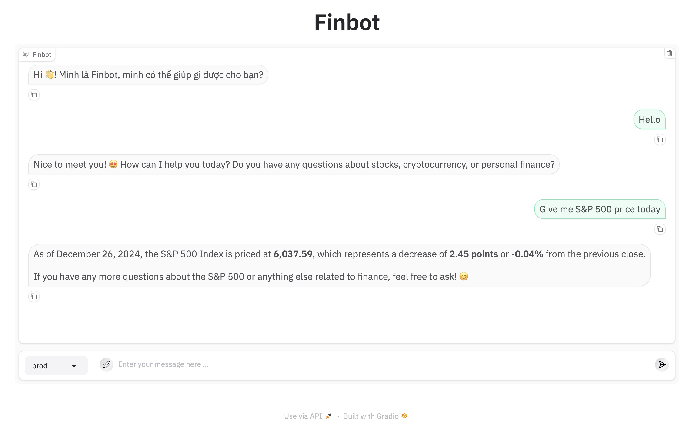

# Realtime RAG Chatbot Project for Finance.



## Table of Contents
- [⭐ Key Features](#⭐-key-features)
- [🚀 Getting Started](#🚀-getting-started)
  - [☑️ Prerequisites](#☑️-prerequisites)
  - [⚙️ Advanced Installation](#⚙️-advanced-installation)
  - [🤖 Usage](#🤖-usage)
- [📌 Project Roadmap](#📌-project-roadmap)
- [🎗 License](#🎗-license)
- [🙌 Contributors](#🙌-contributors)

## ⭐ Key Features


---
## 🚀 Getting Started

### ☑️ Prerequisites

Before getting started with , ensure your runtime environment meets the following requirements:

- **Programming Language:** Python
- **Package Manager:** Pip, Poetry
- **Container Runtime:** Docker

### 🤖 Usage
Run  using the following command:

**Add environment variables to [docker-compose.yaml](./docker-compose.yaml)**  &nbsp; [](https://www.docker.com/)

```sh
services:
  agent:
    image: ghcr.io/datvodinh/finbot:main
    container_name: finbot-agent
    environment:
      - REDIS_HOST=cache-db
      - REDIS_PORT=6479
      - QDRANT_HOST=vector-db
      - QDRANT_PORT=16333
      - OPENAI_API_KEY=
      - GOOGLE_API_KEY=
      - GOOGLE_CSE_ID=
```


**Using `docker`** &nbsp; [](https://www.docker.com/)

```sh
docker compose up -f --build
```

### ⚙️ Advanced Installation

Install  using one of the following methods:

**Build from source:**

1. Clone the  repository:
```sh
git clone https://github.com/datvodinh/finbot.git
```

2. Navigate to the project directory:
```sh
cd 
```

3. Install the project dependencies:

**Using `poetry`** &nbsp; [](https://python-poetry.org/)

```sh
poetry install
```

**Add environment variables to [.env](./apps/agent/)**

```sh
REDIS_HOST=0.0.0.0
REDIS_PORT=6479
QDRANT_HOST=0.0.0.0
QDRANT_PORT=16333
OPENAI_API_KEY=
GOOGLE_API_KEY=
GOOGLE_CSE_ID=
```

**Run using `pip`** &nbsp; [](https://pypi.org/project/pip/)

```sh
python src/main.py
```

---

## 📌 Project Roadmap

- [ ] **`Task 1`**: More Robust Crawling.
- [ ] **`Task 2`**: Support Model from Ollama and Huggingface.

---

## 🎗 License

This project is protected under the [Apache 2 LICENSE](https://choosealicense.com/licenses/apache-2.0/).

---

## 🙌 Contributors

- Shout out to [datvodinh](https://github.com/datvodinh) and [2uanDM](https://github.com/2uanDM) who helped bring this project to life!

---